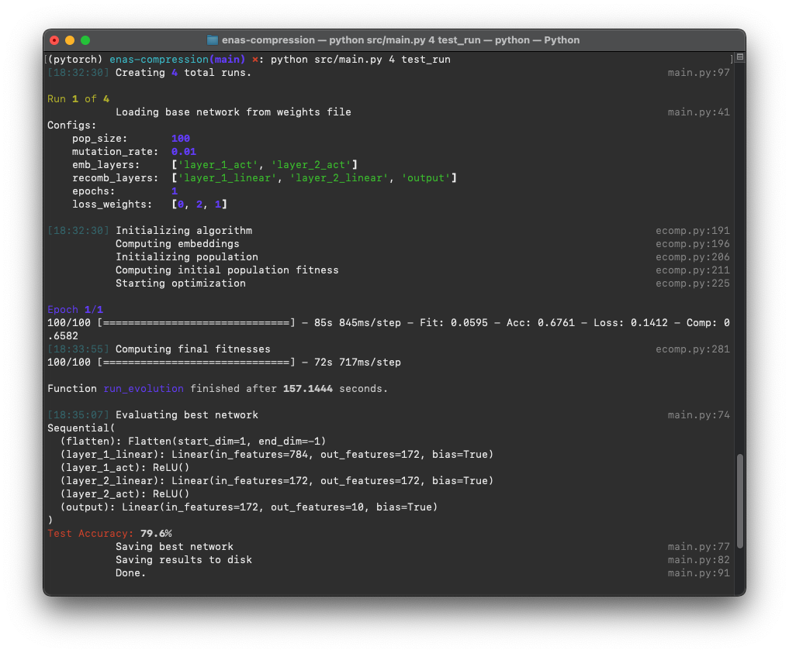

# ENAS Compression

In this repository we implement a novel evolutionary algorithm, EComp, for compressing neural networks. It also includes testing facilities to investigate the resulting compressed networks and the values obtained during optimization. 

## What does it do?

Starting from some parent network you would like to compress, EComp uses an evolutionary strategy with a multiobjective fitness function to search for neural architectures that are smaller in size (i.e. number of nodes in hidden layers). At the heart of this fitness function is the *similarity loss*, a custom loss objective inspired by t-SNE that quantifies the quality of a compressed network's hidden representations as compared to that of the parent network. 

## What is our contribution?

We show that a multiobjective fitness function yields the best results in achieving a balance between test accuracy and compressed size when we employ the similarity loss, as compared to fitness functions that rely solely on accuracy and/or compression rate. For an in-depth description of our experimental findings, please see our report. 

## Hot To Use It

The main library is executable via the `main.py` file. It currently runs optimizations on the FashionMNIST dataset. The hyperparameters can be configured inside `main.py` using the `Configs` object. The default values as defined in `main.py` and used for our experiments are:

```python
configs = Configs(
    POP_SIZE=100,
    MUTATION_RATE=0.01,
    EMB_LAYERS=["layer_1_act", "layer_2_act"],
    RECOMBINATION_LAYERS=["layer_1_linear", "layer_2_linear", "output"],
    EPOCHS=1,
    LOSS_WEIGHTS=[0,2,1]
)
```

Explanations of these parameters can be found in `config.py` or in our report.

### Installation

Before running this library, make sure you install the necessary requirements with 

```bash
pip install -r requirements.txt
```

### Running experiments

Please run everything from the root of this repository to ensure saving works correctly. Assuming you have configured the `Configs` in `main.py` or left them at their default values, you can now run experiments using the following scheme:

```sh
python src/main.py <n_runs> <experiment_name>
```
`n_runs` denotes the number of runs you want to execute the experiment. Pass `1` to try it out, but to collect results you should use a higher number, like `10`, such that randomly bad results can be averaged out. These tend to occur frequently due to the random initialisation of compressed networks, but we found that in 10 runs we usually only find 1 or 2 outliers. 

All experiments are automatically saved. Therefore, provide the `experiment_name` of your choice when calling the script.

A full example of an experiment we conducted for our report thus looks like this:

```sh
python src/main.py 10 weighting121
```

Here is a preview of running it in a terminal:



## Shortcomings

We note that EComp has only been tested as a proof-of-work on simple two-layer feed-forward neural networks using the FashionMNIST dataset. Although the results are very promising, we cannot predict how well they transfer to larger, more complex network architectures like CNNs, or more difficult datasets. 

If you find EComp interesting and would like to use it or build on it, please let us now in the Issues section. 

This project is licensed under the GNU General Public License v3.0.

## Authors

* Thijme de Valk ([tdevalk](https://github.com/tdevalk))
* Stijn van den Beemt ([Tinusdabest](https://github.com/Tinusdabest))
* Pascal Schröder ([verrannt](https://github.com/verrannt))